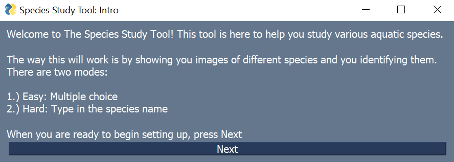
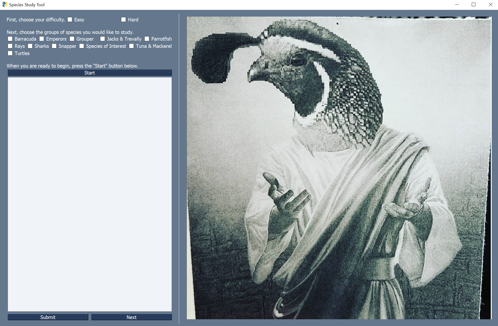
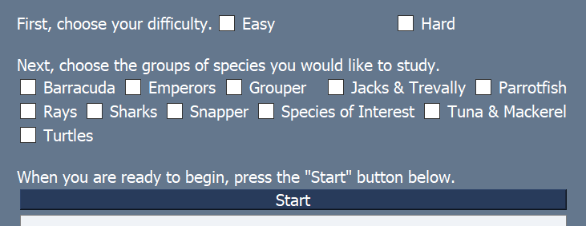
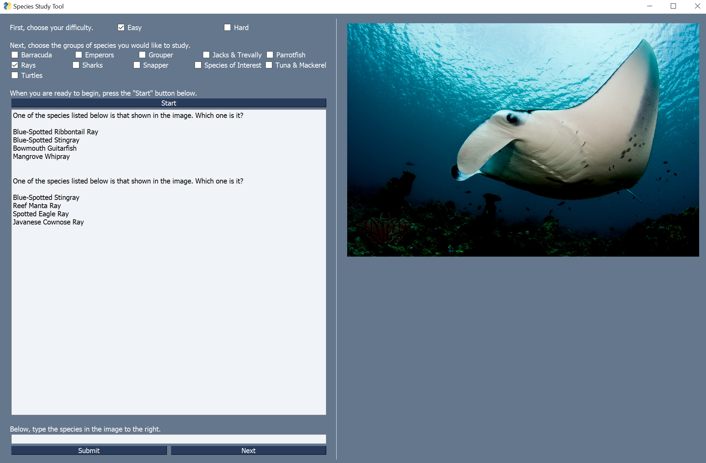

# Project Goal
Learning to identify aquatic species takes time and effort. This projects tries to make learning to distinguish between different species easy by providing a tool that trains you to recognize those differences while providing info about each species.

## How It Works
Using trial and error over many distinct images of each species, the tool teaches you to recognize what makes each species diffent while providing infomation whenever you do make a mistake.

# Setup & Running
## Dependencies

The dependencies are listed in the requirements.txt file, which is prone to be updated with updates to the code. Once these are installed, you are ready to start using the tool!

## Getting the Code
If you are new to GitHub this is a summary of how things work here. You are currently in a repository for this project. To get the code and start running, you need to clone the repository in the directory you want to. There are a few ways to do that, which are easily Google-able. From the terminal or command prompt

    git clone https://github.com/KevinShuman/Fish_ID_Study_Tool.git

## Running the Code

This is as easy as running the Study_GUI.py file while in the repo directory.

    python Study_GUI.py

# What to Expect

The program starts with an intro:

Once you press "Next" it brings up the tool itself:

On the top left, we have different check boxes for different things. We have an easy and hard difficulty that determine if you want multiple choose or direct input.

We also see different groups that are available. Checking one or multiple of these adds the list of species within them to the list of randomly choosen species one would study from. These are referred to as groups in the code.

Once you have choosen a difficulty and one or more groups, you can "Start".

Pressing "Start" changes the photo and text shows up in the output. And input bar also shows up where you can write your answer. Spelling needs to be correct, but capitalization does not.

# How it Works

## Different Classes
Opening the source code Study_GUI.py, you'll see different classes that make up the tool. The basic explanation of the classes:

### Species class:

    class Species:
        '''
        Class to describe a species

        :param name (str): The name of the species
        :param group (str): The group of the species
        :param size (str): The size of the species
        :param position (str): Where the species can be commonly found
        :param group_size (str): How many of the species tend to stay together
        :param appearance (str): The appearance of the species
        :param dist_feats (str): The main features that make this species stand out
        :param occurence (str): How often the species occurs in any given region
        '''

### Group class:

    class Group:
        '''
        The species are assigned to groups. This class contains infomation about the group of
        and all the species within that group

        :param name (str): The name of the group
        :param species (list): List of Species class objects
        '''

### Study Session class:

    class Study_Session:
        '''
        The environment everything plays in. Contains routines that create the study tool
        '''

## How the Information is Stored

Looking at the grab_groups_species() and read_species_csv() functions in the Study Session class one could figure out that all the information is stored in the images directory. Information about each species is contained in a CSV file in each species directory along with all the images of that species. What species and what groups that are used are contained in the directory names within images. This makes adding species and groups pretty easy. Simply add a a new group or species directory, a CSV of the same form as the others, and the images associated with that species.

# To-Do
-An encyclopedia of all the species in the GUI that uses the dictionary of all the species

-If there is a possiblilty to have videos for the encyclopedia, that would be neat

-The ability to add/remove new species/groups from the GUI

-Need a minimum of 4 species in a group for easy mode, need a warning for this or it will crash

-~~The images changing size is kind of distracting, it would be nice to keep things static, though we don't want to mess with image quality~~

-More unique images using a webscapper

-Add details on the wrong answer as well. Need to flag options that are misspelled or blank and show nothing.

-Add reset button that resets your score, so if you want to switch from one group to another or just start over.